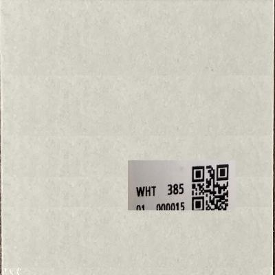

# Object Detection : printed label detection 

------------------

### This project is for detecting the mis-printed label 

#### The model detecte the printed label in real time 
- using cv2 
- detected printed label using videocam 
- finetune the pretrained objecte detection model resnet50

## Sample images and Results

> printed label

> Blurred image

> Empty Label

> Not detected Label

> False Negative Label

## Class Activation Heatmap 

#### For production false positive is morre important than false negative 
- This models shows the very low false positive rate

## For training 
- There are few negative(False) example avaialble 
- To make up this I genrated Synthetic False exmaples 

> Generated False Example 

## Model : 2 step:
- 1) Object detection 
    : Detect the printed label area using 
   > finetune model : ssd_resnet50_v1_fpn_640x640_coco17
- 2) Classification 
    : Classify the true / false labeled print 
   > finetune model : mobilenet 

## requirements 

- 1. install required package 
`pip install -r requirements.txt`

- 2. install imageai package
`pip install imageai --upgrade`

